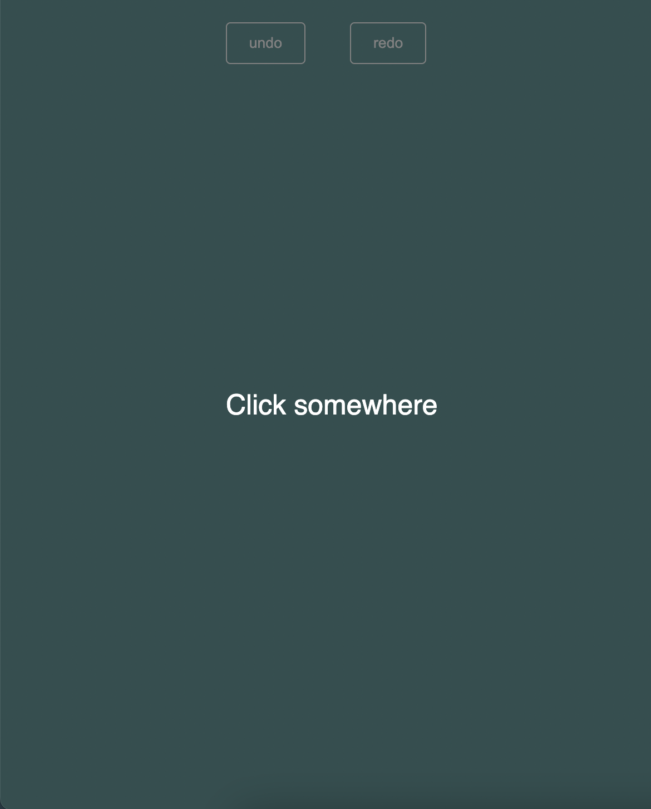
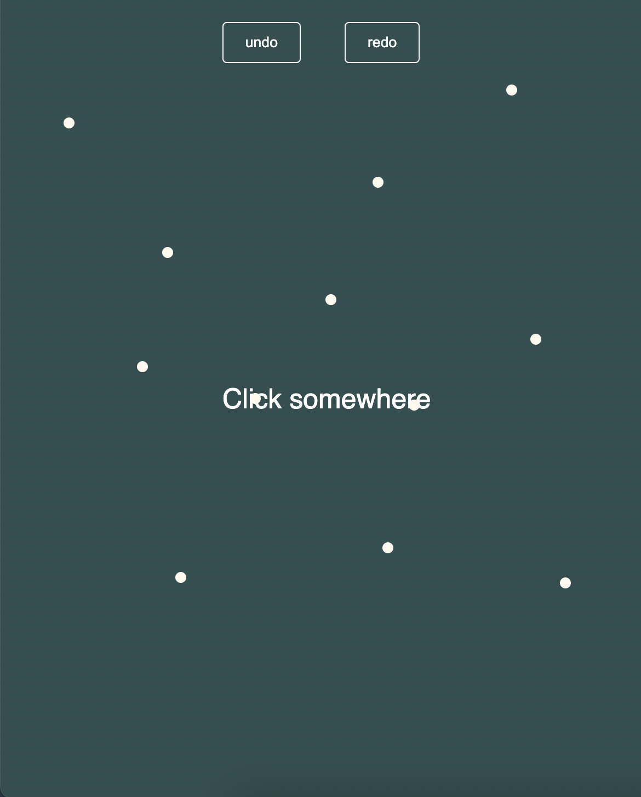

# Mouse click history (Simple React App)

If you don't want to install this application locally, you can see and try it on [code pen](https://codepen.io/vadi_kot/pen/WNygJgv).

## Installation

1. Open command line
2. Clone this project to your computer: `git clone https://github.com/vadikot/mouse-click-history`
3. Install all npm packages in the project: `npm i`
4. Run the app: `npm start`

## Application screenshots

